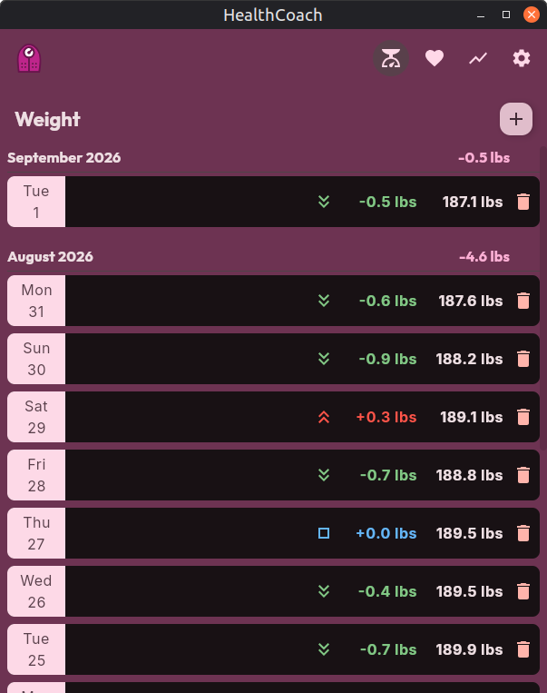
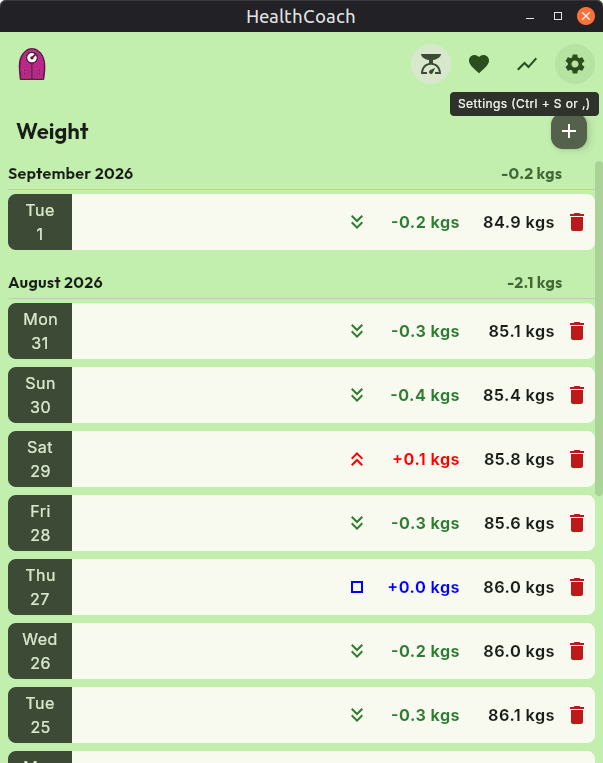
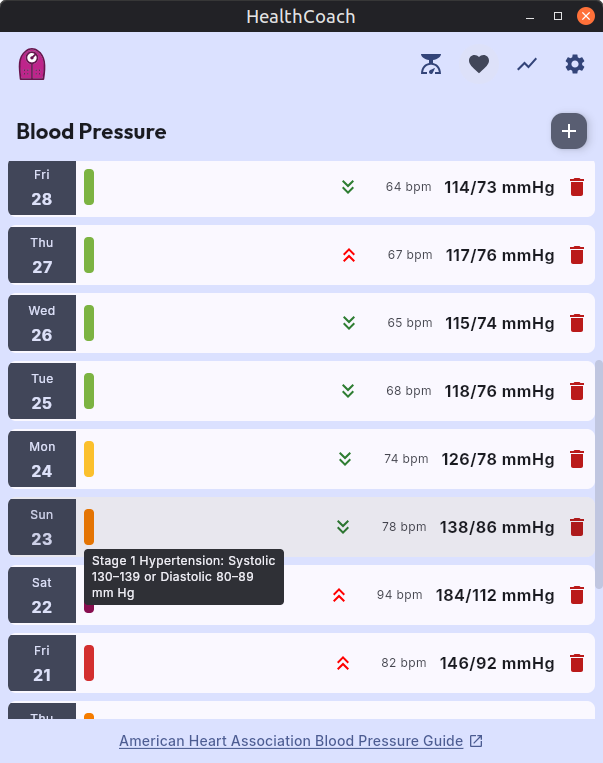
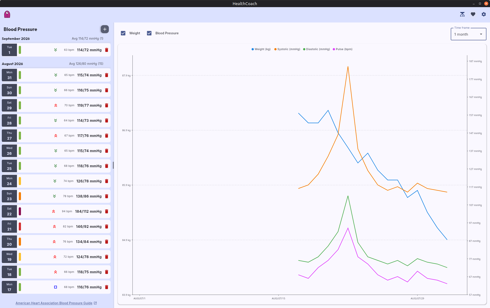
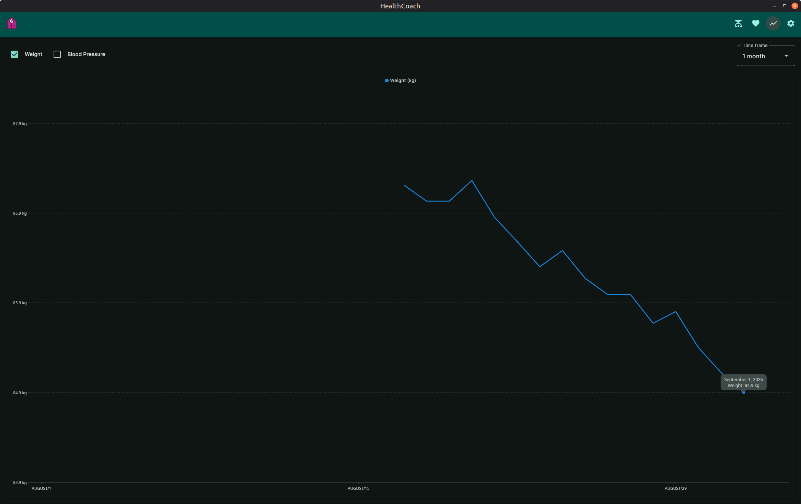
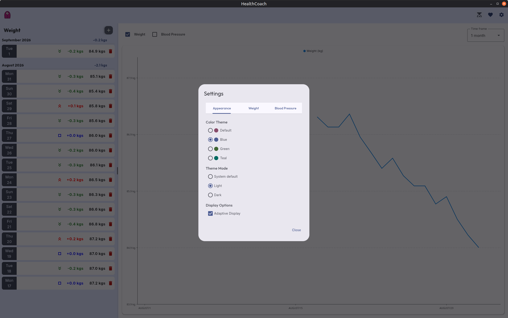
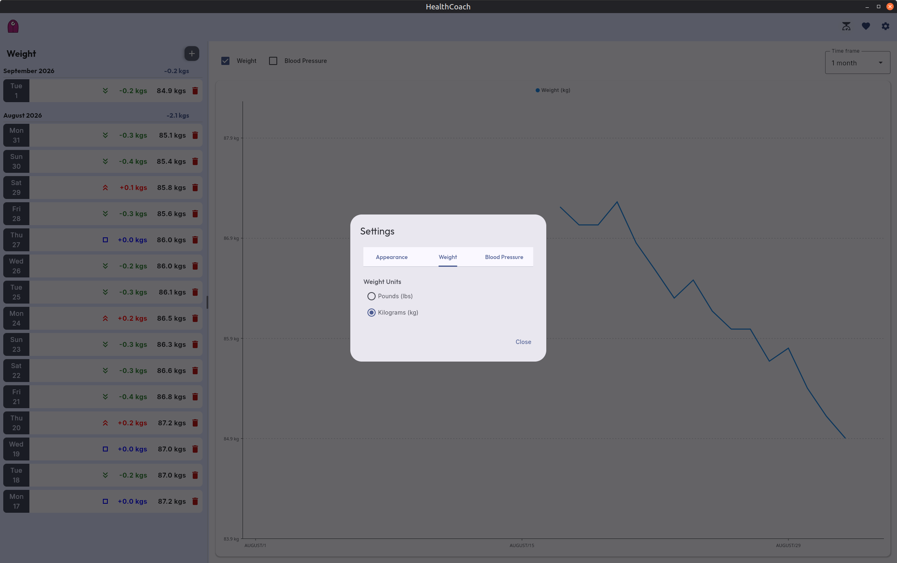

# HealthCoach

[](https://kotlinlang.org/docs/multiplatform.html)
[](https://m3.material.io/)
[](https://cashapp.github.io/sqldelight/)
[](LICENSE)

**HealthCoach** is a modern, local-first personal health tracking desktop and mobile application built with **Kotlin Multiplatform (KMP)** and **Compose Multiplatform**. It empowers users to monitor vital health indicators—such as body weight, blood pressure, and pulse—with actionable analytics, AHA guideline integration, compound multi-axis charts, and customizable Material 3 themes.

---

## 📸 Screenshots & UI Showcase

| Weight Tracking & Analytics | Blood Pressure & AHA Categories |
| :---: | :---: |
|  <br /> |  |

| Compound Multi-Axis Graphs | Tabbed Settings & Themes |
| :---: | :---: |
|  <br />  |  <br />  |

---

## ✨ Key Features

### ⚖️ Weight Tracking & History
* **Effortless Logging**: Quickly record weight entries in either Imperial (`lbs`) or Metric (`kg`) units.
* **Chronological Grouping**: Entries are grouped by Month and Year with Day-of-Week badges for intuitive timeline navigation.
* **Delta Comparison Indicators**: Visual change indicators highlighting differences between consecutive weigh-ins (weight loss in green, gain in red, neutral in blue).
* **Monthly Summaries**: Header statistics calculating net weight change per calendar month.
* **Full CRUD Management**: In-line editing, updating, and safe deletion with confirmation modals.

### 🩺 Blood Pressure & Pulse Management
* **Tri-Metric Logging**: Track **Systolic** (mmHg), **Diastolic** (mmHg), and optional **Pulse** (bpm) in a single flow.
* **Flexible Date/Time Recording**: Support for date-only entries as well as precise localized time capture (persisted in RFC 3339 Zulu UTC format).
* **Live AHA Category Classification**: Entries are automatically classified according to current [American Heart Association Guidelines](https://www.heart.org/en/health-topics/high-blood-pressure/understanding-blood-pressure-readings):
  * 🟢 **Normal**: Systolic < 120 and Diastolic < 80
  * 🟡 **Elevated**: Systolic 120–129 and Diastolic < 80
  * 🟠 **Stage 1 Hypertension**: Systolic 130–139 or Diastolic 80–89
  * 🔴 **Stage 2 Hypertension**: Systolic ≥ 140 or Diastolic ≥ 90
  * 🚨 **Hypertensive Crisis**: Systolic > 180 and/or Diastolic > 120
* **Interactive Category Tooltips**: Hover tooltips explaining the clinical criteria for each classification.
* **Guideline Reference**: Integrated footer link directly accessing the official AHA High Blood Pressure Guide.

### 📈 Compound Health Graphs
* **Dual-Axis Visualization**: Multi-layered time-series charts powered by [Vico](https://github.com/patrykandpatrick/vico).
* **Decoupled Scaling**: Independent Y-axis scaling for Weight (Start/Left Axis) and Blood Pressure/Pulse (End/Right Axis), ensuring neither dataset compresses or distorts the other.
* **Configurable Series**: Toggle individual chart series on the fly:
  * 🔵 **Weight** (`lbs` / `kg`)
  * 🟠 **Systolic Pressure** (`mmHg`)
  * 🟢 **Diastolic Pressure** (`mmHg`)
  * 🟣 **Pulse** (`bpm`)
* **Dynamic Time Frames**: Filter charts across **All Time**, **3 Years**, **1 Year**, **6 Months**, **3 Months**, **1 Month**, **2 Weeks**, **1 Week**, or **3 Days**.
* **Interactive Tooltips & Legend**: Hover markers showing exact date and metric values along with a color-coded legend.

### 🎨 Theming & Typography
* **4 Curated Material 3 Themes**:
  * **Default Theme**: Burgundy / Rose palette
  * **Blue Theme**: Indigo / Navy palette
  * **Green Theme**: Forest / Olive palette
  * **Teal Theme**: Cyan / Teal palette
* **Theme Modes**: Full support for **Light**, **Dark**, and **System Default** modes.
* **Typography**: Embedded Google Fonts bundled cross-platform—**Outfit** for headlines/titles and **Inter** for body text and labels.

### 🖥️ Adaptive Layout & Split-Pane Mode
* **Adaptive Dual-Pane Display**: On wide screens / desktop displays, view the data entry list on the left and the real-time compound graph on the right simultaneously.
* **Adjustable Splitter**: Smoothly adjust the divider width between views with persisted positioning.
* **Responsive Single-View**: Automatically collapses into a single-pane tabbed view on compact displays and mobile targets.

### ⌨️ Desktop Keyboard Shortcuts
| Shortcut | Action |
| :--- | :--- |
| `Ctrl + W` | Navigate to **Weight** view |
| `Ctrl + B` | Navigate to **Blood Pressure** view |
| `Ctrl + G` | Navigate to **Graphs** view |
| `Ctrl + N` | Open **Add Entry** dialog for current feature |
| `Ctrl + S` | Open **Settings** dialog |
| `Ctrl + Q` | Quit application |

---

## 💾 Data Storage & Privacy

HealthCoach is **100% local-first and private**. No data is sent to external servers, cloud services, or telemetry endpoints. All personal health data and settings reside entirely on your local filesystem.

### 1. Database Storage (`healthcoach.db`)
* **Engine**: Embedded **SQLite** database managed via **SqlDelight**.
* **Integrity & Migrations**: Schema evolution is strictly managed through versioned SQL migration scripts (`sqldelight/migrations`).
* **Tables**:
  * `weight_entry`: Stores chronological weight records and date values.
  * `blood_pressure_entry`: Stores systolic, diastolic, pulse, and timestamp records.

### 2. Configuration & Preferences (`settings.json`)
* **Format**: Human-readable, pretty-printed JSON powered by **Kotlinx.Serialization**.
* **Persisted Options**: Active theme, theme mode (light/dark/system), weight unit (`LBS`/`KG`), adaptive split-pane state, graph series visibility toggles, and time-frame preferences.

### 📂 File Storage Locations by Operating System

| Platform | Database Path (`healthcoach.db`) | Settings Path (`settings.json`) |
| :--- | :--- | :--- |
| **Linux** | `~/.local/share/healthcoach/healthcoach.db` | `~/.local/share/healthcoach/settings.json` |
| **macOS** | `~/Library/Application Support/healthcoach/healthcoach.db` | `~/Library/Application Support/healthcoach/settings.json` |
| **Windows** | `%LOCALAPPDATA%\healthcoach\healthcoach.db` | `%LOCALAPPDATA%\healthcoach\settings.json` |
| **Android** | `/data/data/com.lbthomas.healthcoach/databases/healthcoach.db` | `/data/data/com.lbthomas.healthcoach/files/settings.json` |

*Note: On Linux, if `$XDG_DATA_HOME` is set in your environment, the directory defaults to `$XDG_DATA_HOME/healthcoach/`.*

---

## 🏗️ Architecture & Tech Stack

```
HealthCoach/
├── androidApp/               # Android platform entrypoint & manifest
├── desktopApp/               # Desktop JVM launcher & packaging configuration
└── shared/                   # Shared Multiplatform Kotlin module
    ├── commonMain/           # UI (Compose), ViewModels, Repositories, Domain models, DB schema
    ├── jvmMain/              # JVM JDBC driver factory & platform settings injection
    └── androidMain/          # Android SQLite driver factory & context bindings
```

* **UI Toolkit**: [Compose Multiplatform](https://www.jetbrains.com/lp/compose-multiplatform/) (Material 3)
* **Dependency Injection**: [Koin](https://insert-koin.io/)
* **Database**: [SqlDelight](https://cashapp.github.io/sqldelight/) with SQLite
* **Charting Engine**: [Vico](https://github.com/patrykandpatrick/vico)
* **Serialization & Async**: `kotlinx.serialization`, `kotlinx.coroutines`, `kotlinx.datetime`

---

## 🚀 Building & Running

### Prerequisites
* **JDK 17** or higher
* **Android SDK** (optional, only required when building the Android target)

### Desktop Application
* **Run application**:
  ```bash
  ./gradlew :desktopApp:run
  ```
* **Hot reload (live development)**:
  ```bash
  ./gradlew :desktopApp:hotRun --auto
  ```
* **Package desktop distribution**:
  ```bash
  ./gradlew :desktopApp:packageDistributionForCurrentOS
  ```

### Android Application
* **Assemble Debug APK**:
  ```bash
  ./gradlew :androidApp:assembleDebug
  ```

### Running Tests
* **Execute all unit & shared tests**:
  ```bash
  ./gradlew :shared:jvmTest
  ```
* **Execute full test suite**:
  ```bash
  ./gradlew test
  ```

---

## 👤 Author & Attribution

* **Application**: HealthCoach (v0.9.0)
* **Author**: Thomas Baker
* **Repository**: [https://github.com/bigtlb/healthcoach](https://github.com/bigtlb/healthcoach)

---

## 📄 License & Third-Party Credits

* **Application License**: This project is licensed under the Apache License, Version 2.0. See the [LICENSE](LICENSE) file for the full license text.
* **Open Source Attributions**: HealthCoach incorporates open-source libraries, components, and font assets. See [OPEN_SOURCE_LICENSES.txt](OPEN_SOURCE_LICENSES.txt) for comprehensive third-party notices, copyright statements, and complete license texts.
