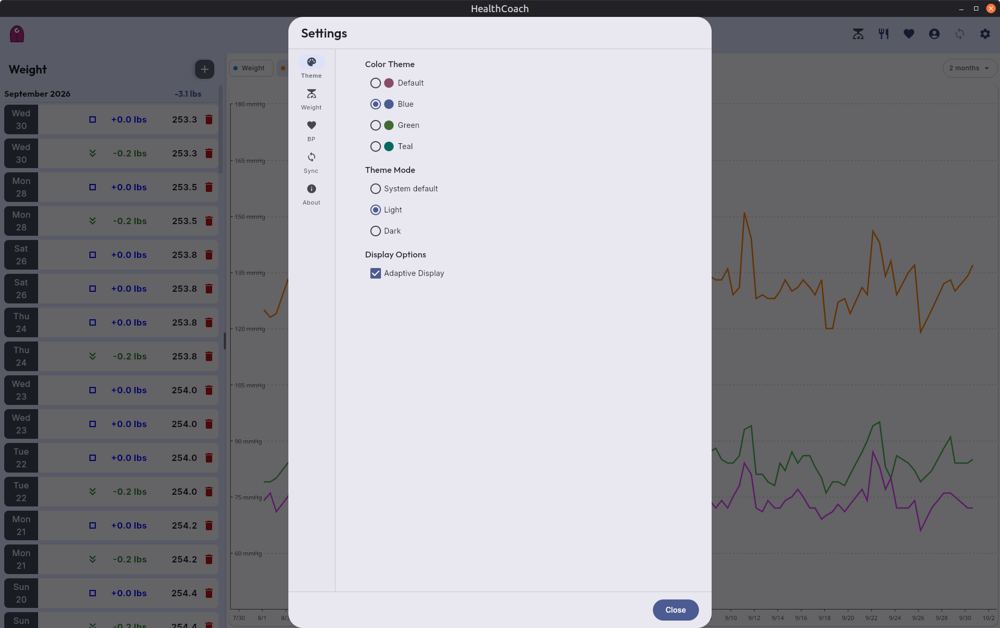
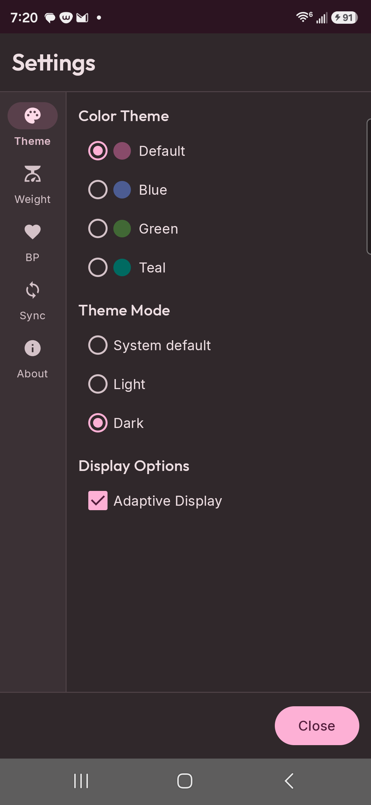

# HealthCoach

[](https://github.com/bigtlb/healthcoach/actions/workflows/release.yml)
[](https://github.com/bigtlb/healthcoach/releases)
[](LICENSE)
[](https://bigtlb.github.io/healthcoach/)

**HealthCoach** is a modern, local-first personal health management and analytics application built with **Kotlin Multiplatform (KMP)** and **Compose Multiplatform**. Designed to maximize user empowerment, health insight, and day-to-day tracking efficiency, HealthCoach gives you total control over your health metrics—including body weight, blood pressure, pulse, daily nutrition, and metabolic targets—backed by robust analytics, AHA clinical classifications, compound multi-axis charts, and seamless cross-device synchronization.

🌐 **Website & Downloads**: [https://bigtlb.github.io/healthcoach](https://bigtlb.github.io/healthcoach/)

---

## ⚕️ Medical & Health Disclaimer

HealthCoach is designed and provided solely for personal health tracking, wellness organization, and informational purposes. HealthCoach is **not a certified medical device** and does not provide clinical diagnoses, medical advice, treatment plans, or emergency health intervention.

The clinical classifications (such as American Heart Association blood pressure categories) and metabolic calculations (such as Mifflin-St Jeor BMR and TDEE estimates) provided in this application are general educational references only. Always consult a qualified physician or licensed healthcare professional before making health, dietary, exercise, or medical decisions, or if you have concerns regarding your blood pressure readings, heart rate, or body weight.

For full terms and conditions, see [DISCLAIMER.md](DISCLAIMER.md).

---

## 🔒 User Data Sovereignty & Absolute Privacy

HealthCoach is engineered from the ground up around **complete user data sovereignty**:

* **100% Local-First Storage**: Your health information is stored in an embedded SQLite database (`healthcoach.db`) on your physical device.
* **Zero Telemetry & Zero Analytics**: No tracking pixels, no telemetry hooks, no diagnostics reporting, and no background communication with any developer or analytics servers.
* **No Third-Party Intermediaries**: Your personal records are never sent, sold, scanned, or uploaded to any third party or centralized cloud server.
* **Explicit User-Controlled Sync**: Data only leaves your device when you explicitly configure and initiate synchronization. It is transmitted solely to storage endpoints you own and control:
  * **Local / Mounted Folders**: Personal local folders, USB storage, or directories synchronized by your personal cloud clients (Proton Drive, OneDrive, Dropbox).
  * **Google Drive Application Sandbox**: An isolated, private partition (`appDataFolder`) accessible only by your authenticated Google account, invisible to standard Drive file listings.
  * **Peer-to-Peer LAN Streaming**: Direct, local Wi-Fi synchronization between your devices over a PIN-authenticated and paired connection without touching the public internet.

---

## 📸 Visual Showcase & Feature Gallery

HealthCoach provides a tailored user experience across both desktop workstations and mobile devices:

| Desktop Experience (Adaptive Dual-Pane Split View) | Mobile Experience (Touch-Optimized Single Pane) |
| :---: | :---: |
| [](docs/images/theming-desktop.png) | [](docs/images/theming-mobile.png) |
| *Side-by-side data tables and live charts with custom themes* | *Responsive navigation and touch-first logging workflows* |

👉 **[Explore the Complete Visual Feature Gallery (24 Screenshots across Desktop & Mobile)](docs/GALLERY.md)**

*(Detailed visual walkthrough covering Weight Analytics, Blood Pressure classifications, Food Journaling & Portion Scaling, Metabolic Profiling, Multi-Axis Compound Graphs, and P2P Wi-Fi Sync.)*

---

## ✨ Key Capabilities & Features

### ⚖️ Weight Tracking & Analytics
* **Fast, Frictionless Logging**: Record body weight in Imperial (`lbs`) or Metric (`kg`) with instantaneous unit conversion.
* **Chronological Grouping**: Entries structured by Month and Year with Day-of-Week badges for swift navigation across long histories.
* **Visual Delta Indicators**: Clear color-coded change badges between consecutive weigh-ins (loss in green, gain in red, neutral in blue) to immediately highlight progression trends.
* **Monthly Aggregates**: Header statistics calculating net weight change and overall trajectory per calendar month.
* **Full CRUD Operations**: In-line editing, timestamp adjustments, and safe deletion guarded by confirmation dialogs.

### 🩺 Blood Pressure & Pulse Management
* **Tri-Metric Precision**: Capture **Systolic** (mmHg), **Diastolic** (mmHg), and optional **Pulse** (bpm) in a unified, streamlined interface.
* **Flexible Date/Time Capture**: Log date-only entries or exact localized timestamps (persisted in standard RFC 3339 UTC format).
* **Live AHA Guideline Classification**: Automatic categorization according to official [American Heart Association Guidelines](https://www.heart.org/en/health-topics/high-blood-pressure/understanding-blood-pressure-readings):
  * 🟢 **Normal**: Systolic < 120 and Diastolic < 80
  * 🟡 **Elevated**: Systolic 120–129 and Diastolic < 80
  * 🟠 **Stage 1 Hypertension**: Systolic 130–139 or Diastolic 80–89
  * 🔴 **Stage 2 Hypertension**: Systolic ≥ 140 or Diastolic ≥ 90
  * 🚨 **Hypertensive Crisis**: Systolic > 180 and/or Diastolic > 120
* **Interactive Diagnostic Tooltips**: Contextual tooltips explaining clinical thresholds for each reading category.
* **Integrated Medical Reference**: Quick-access link directly to the official AHA High Blood Pressure Guide.

### 🥗 Food Journaling & Caloric Tracking
* **Daily Meal Breakdown**: Log meals organized into **Breakfast**, **Lunch**, **Dinner**, and **Snacks**.
* **Master Food Library**: Maintain a personalized catalog of foods with standard serving sizes, unit measures, and caloric densities.
* **Rapid Entry & Reuse**: Instantly re-log items from **Recent Foods** or **Frequent Foods** lists with single-click additions.
* **Dynamic Portion Calculator**: Adjust serving quantities and units with automatic real-time calorie recalculation.
* **Real-Time Caloric Summaries**: Daily overview cards displaying total consumed calories versus maintenance baseline and goal targets.

### 👤 User Profile & Metabolic Goals
* **Metabolic Baseline Estimation**: Automatically calculate Basal Metabolic Rate (**BMR**) and Total Daily Energy Expenditure (**TDEE**) using the validated **Mifflin-St Jeor formula**.
* **Personalized Goal Modes**: Configure caloric deficit or surplus targets using **Rate Goals** (e.g., lose 1 lb/week), **Timeline Goals** (target weight by target date), or **Direct Manual Calorie Adjustments**.
* **Goal Trajectory Projections**: Clear visual projections comparing expected weight loss/gain timelines against actual progress.

### 📈 Compound Multi-Axis Graphs
* **Decoupled Multi-Layer Visualization**: Built on [Vico](https://github.com/patrykandpatrick/vico) with independent scaling for Weight (Left Axis), Blood Pressure/Pulse (Right Axis), and Calories (Background/Left Axis).
* **Intelligent Graduation Stepping**: Quantized Y-axis graduation intervals strictly divisible by 5 (for Weight and Blood Pressure) and 50 (for Calories), dynamically adapting step sizes (e.g., 5, 10, 15, 20, 25, 30, 50) to prevent visual crowding.
* **Adaptive Long-Term Timeframes**: Smart bottom axis date formatting that transitions from daily/monthly labels to condensed `YY/MM` (e.g., `26/01`) across multi-year spans to maximize temporal clarity.
* **Flexible Layer Toggles**: Turn individual series on or off dynamically:
  * 🔵 **Weight** (`lbs` / `kg`)
  * 🟠 **Systolic Pressure** (`mmHg`)
  * 🟢 **Diastolic Pressure** (`mmHg`)
  * 🟣 **Pulse** (`bpm`)
  * 🟡 **Calorie Intake** (`kcal`)
  * ⚪ **Maintenance & Target Calorie Lines**
* **Mobile Touch & Desktop Hover Markers**: Interactive tooltips and data point inspection via hover on desktop and drag/touch on mobile devices.

### 🔄 Multi-Device Synchronization & Networking
* **3-Way Differential Merge Engine**: Robust reconciliation algorithm (`BASE`, `LOCAL`, `REMOTE`) with UUID keys and `updated_at` last-write-wins conflict resolution, guaranteeing zero data loss across concurrent edits.
* **SQLite Schema Compatibility Gating**: Pre-sync validation via SQLite `PRAGMA user_version` protecting databases from schema mismatch corruption.
* **Multiple Storage Targets**:
  * **Local Folder & Mounted Drives**: Direct sync to local directories, USB keys, or desktop cloud mounts (Proton Drive, OneDrive, Dropbox).
  * **Google Drive (`appDataFolder`)**: PKCE OAuth 2.0 desktop synchronization directly with Google Drive's isolated application storage.
  * **Peer-to-Peer LAN Synchronization**: Symmetric embedded Ktor server/client enabling direct Wi-Fi sync between Desktop and Android devices with mDNS zero-configuration discovery and PIN-authenticated pairing.
* **Audit Metadata & Live UI Indicators**: Animated top-bar sync button, error badge overlays, sync history timestamps, and toast notifications on remote connection.

### 🎨 Theming, Layout & Accessibility
* **Adaptive Dual-Pane Split View**: On desktop and wide screens, view logs and live compound charts side-by-side with an adjustable, persistent splitter.
* **Responsive Single-Pane View**: Seamlessly condenses into an intuitive single-pane navigation flow on compact mobile devices.
* **4 Material 3 Palettes**: Default (Burgundy/Rose), Blue (Indigo/Navy), Green (Forest/Olive), and Teal (Cyan/Teal).
* **Theme Modes**: Full support for Light, Dark, and System Default appearance.
* **High-Legibility Typography**: Embedded Google Fonts bundled natively cross-platform—**Outfit** for headlines/titles and **Inter** for data grids and metrics.

### ⌨️ Desktop Keyboard Shortcuts
| Shortcut | Action |
| :--- | :--- |
| `Ctrl + W` | Open **Weight** view |
| `Ctrl + B` | Open **Blood Pressure** view |
| `Ctrl + J` | Open **Food Journal** view |
| `Ctrl + G` | Open **Compound Graphs** view |
| `Ctrl + P` | Open **Profile & Goals** dialog |
| `Ctrl + N` | Open **Add Entry** dialog for current view |
| `Ctrl + S` | Open **Settings & Sync** dialog |
| `Ctrl + Q` | Quit application |

---

## 💾 Local Data Storage & Platform Paths

All data is structured for high reliability, zero data corruption, and easy backups:

1. **Database (`healthcoach.db`)**: Embedded SQLite database managed with **SqlDelight**, featuring automated migration scripts for safe schema evolution.
2. **Configuration (`settings.json`)**: Human-readable, pretty-printed JSON storing user preferences, theme selections, active sync configurations, and display toggles.

### Standard File Storage Paths
| Platform | Database Location (`healthcoach.db`) | Preferences Location (`settings.json`) |
| :--- | :--- | :--- |
| **Linux** | `~/.local/share/healthcoach/healthcoach.db` | `~/.local/share/healthcoach/settings.json` |
| **Windows** | `%LOCALAPPDATA%\healthcoach\healthcoach.db` | `%LOCALAPPDATA%\healthcoach\settings.json` |
| **macOS** | `~/Library/Application Support/healthcoach/healthcoach.db` | `~/Library/Application Support/healthcoach/settings.json` |
| **Android** | `/data/data/com.lbthomas.healthcoach/databases/healthcoach.db` | `/data/data/com.lbthomas.healthcoach/files/settings.json` |

*Note: On Linux, `$XDG_DATA_HOME/healthcoach/` is respected when set in your environment.*

---

## 🏗️ Architecture & Tech Stack

```
HealthCoach/
├── androidApp/               # Android entrypoint, manifests & platform bindings
├── desktopApp/               # Desktop JVM launcher & native packaging configs
└── shared/                   # Shared Multiplatform Kotlin codebase
    ├── commonMain/           # UI (Compose), ViewModels, Repositories, Domain models, Sync engine
    ├── jvmMain/              # JVM JDBC driver factory, JmDNS discovery, PKCE auth server
    └── androidMain/          # Android SQLite driver factory, NsdManager discovery, Android context
```

* **Core Language & Framework**: [Kotlin Multiplatform](https://kotlinlang.org/docs/multiplatform.html) & [Compose Multiplatform](https://www.jetbrains.com/lp/compose-multiplatform/) (Material 3)
* **Dependency Injection**: [Koin](https://insert-koin.io/)
* **Database & Persistence**: [SqlDelight](https://cashapp.github.io/sqldelight/) with SQLite
* **Data Visualization**: [Vico](https://github.com/patrykandpatrick/vico) Multiplatform Charting
* **Networking & LAN Server**: [Ktor](https://ktor.io/) Client and Embedded CIO Server
* **Discovery & Networking**: JmDNS (Desktop) & Android `NsdManager` (mDNS / DNS-SD)
* **Concurrency & Time**: `kotlinx.coroutines`, `kotlinx.serialization`, `kotlinx.datetime`

---

## 🚀 Building & Running

### Prerequisites
* **JDK 17** or higher
* **Android SDK** (API Level 34+; required only when building Android target)

### Desktop Application
* **Launch desktop application**:
  ```bash
  ./gradlew :desktopApp:run
  ```
* **Hot reload development**:
  ```bash
  ./gradlew :desktopApp:hotRun --auto
  ```
* **Package desktop distribution**:
  ```bash
  ./gradlew :desktopApp:packageDistributionForCurrentOS
  ```

### Android Application
* **Assemble Debug APK**:
  ```bash
  ./gradlew :androidApp:assembleDebug
  ```
* **Install to connected device/emulator**:
  ```bash
  ./gradlew :androidApp:installDebug
  ```

### Running Test Suite
* **Run shared Multiplatform unit tests**:
  ```bash
  ./gradlew :shared:jvmTest
  ```
* **Run all project tests**:
  ```bash
  ./gradlew test
  ```

---

## 👤 Author & Attribution

* **Application**: HealthCoach
* **Author**: Thomas Baker
* **Repository**: [https://github.com/bigtlb/healthcoach](https://github.com/bigtlb/healthcoach)

---

## 📄 License & Third-Party Credits

* **Application License**: Licensed under the Apache License, Version 2.0. See the [LICENSE](LICENSE) file for terms.
* **Third-Party Notices**: HealthCoach incorporates open-source libraries and fonts. Detailed attributions and license texts are provided in [OPEN_SOURCE_LICENSES.txt](OPEN_SOURCE_LICENSES.txt).
