# HealthCoach Visual Feature Gallery

A comprehensive visual walkthrough of HealthCoach across Desktop and Android platforms. 

> 💡 **Tip**: All thumbnails are scaled uniformly to preserve layout balance. Click any image thumbnail to inspect the full-resolution screenshot in a new tab.

---

## ⚖️ Weight Tracking & Analytics

Chronological weigh-in log featuring automatic unit conversion (`lbs` / `kg`), consecutive delta indicators, and monthly net change statistics.

| View | Screenshot (Click to enlarge) | Highlights |
| :--- | :---: | :--- |
| **Desktop** | [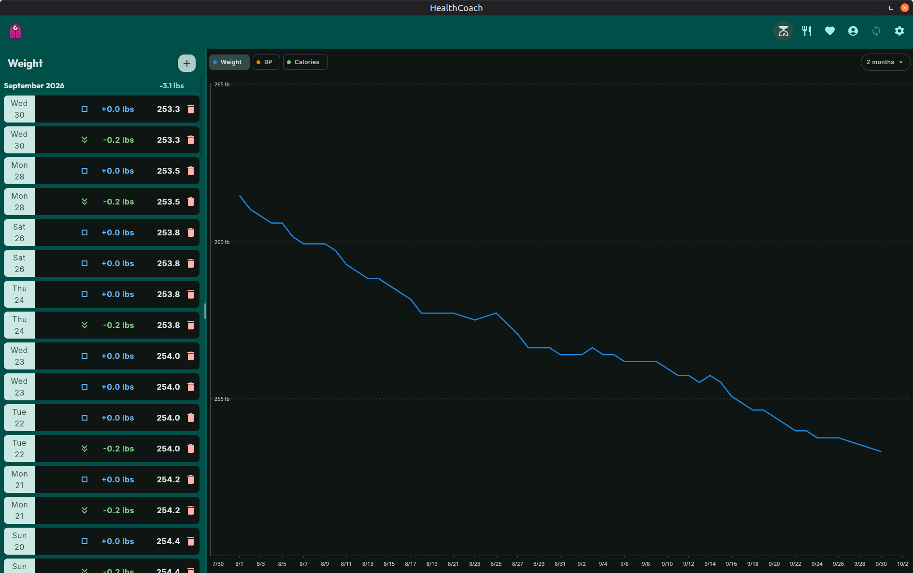](images/weight-desktop.png) | • Grouped by month and year with day-of-week badges • Color-coded delta badges highlighting immediate loss/gain • Monthly aggregate progress headers |
| **Mobile** | [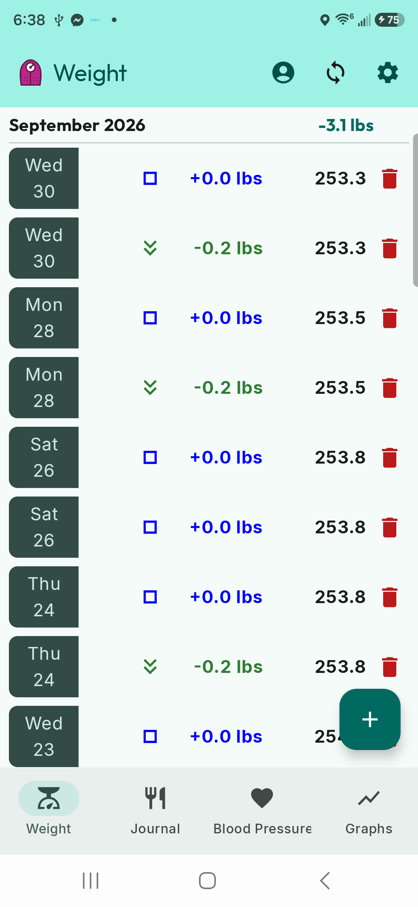](images/weight-mobile.png) | • Touch-optimized single-pane list with swipe actions • Fast floating action button for instant logging |

---

## 🩺 Blood Pressure & AHA Classifications

Tri-metric recording (Systolic, Diastolic, Pulse) with real-time American Heart Association clinical classifications and diagnostic guidance.

| View | Screenshot (Click to enlarge) | Highlights |
| :--- | :---: | :--- |
| **Desktop** | [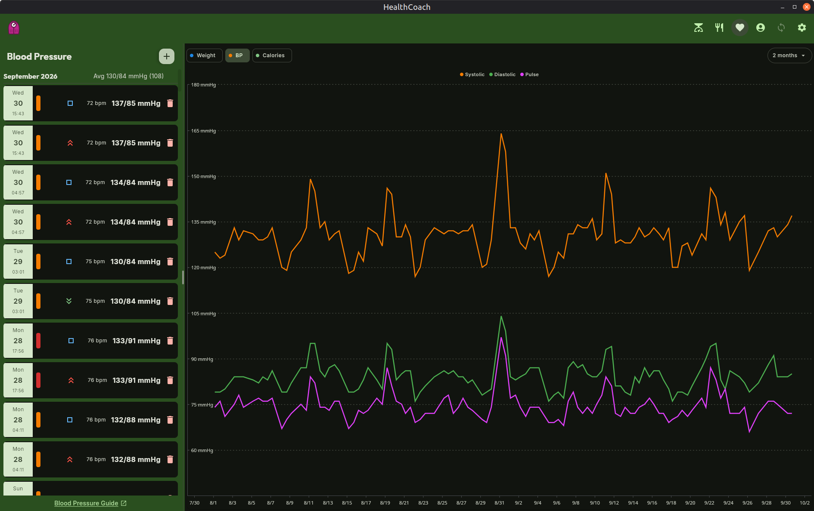](images/blood-pressure-desktop.png) | • Live classification badges (Normal, Elevated, Stage 1/2, Crisis) • Interactive clinical threshold tooltips • Exact timestamp tracking and monthly averages |
| **Mobile** | [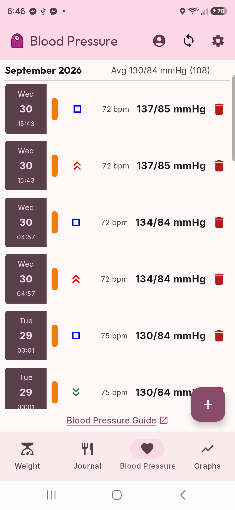](images/blood-pressure-mobile.png) | • High-contrast AHA category indicators • Quick date/time picker modal integration |

---

## 🥗 Food Journaling & Meal Tracking

Daily meal logging structured across Breakfast, Lunch, Dinner, and Snacks with live caloric progress against personal targets.

| View | Screenshot (Click to enlarge) | Highlights |
| :--- | :---: | :--- |
| **Desktop** | [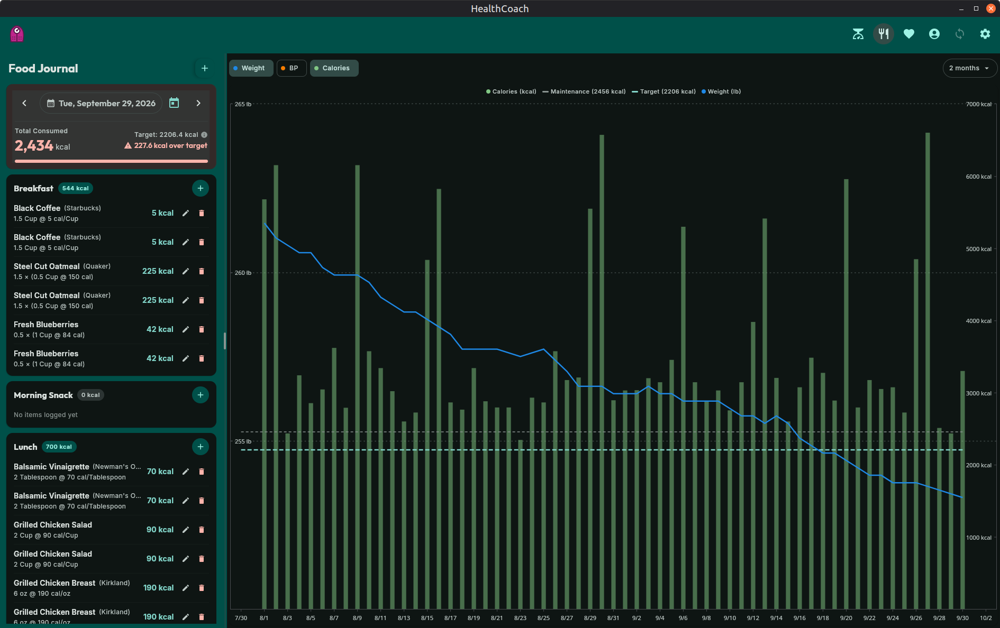](images/food-journal-1-desktop.png) | • Chronological daily log divided by meal category • Daily caloric totals against maintenance and deficit goals • Direct food search and custom entry launcher |
| **Mobile** | [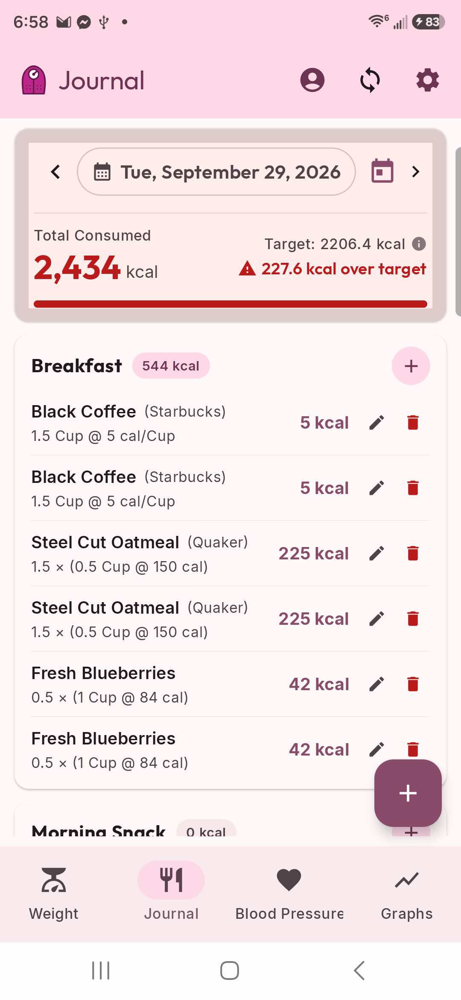](images/food-journal-1-mobile.png) | • Compact meal-by-meal calorie summary cards • Tap-to-edit food portion entries |

---

## 🔍 Food Database & Portion Calculator

Master food database management with serving size scaling, quick re-logging from recent/frequent items, and custom food creation.

| View | Screenshot (Click to enlarge) | Highlights |
| :--- | :---: | :--- |
| **Search & Catalog** (Desktop) | [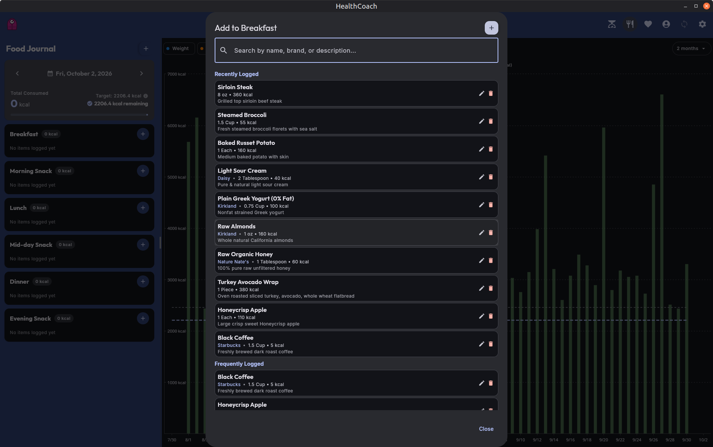](images/food-journal-2-desktop.png) | • Instant search across master food catalog • Frequent and Recent tabs for 1-click additions |
| **Search & Catalog** (Mobile) | [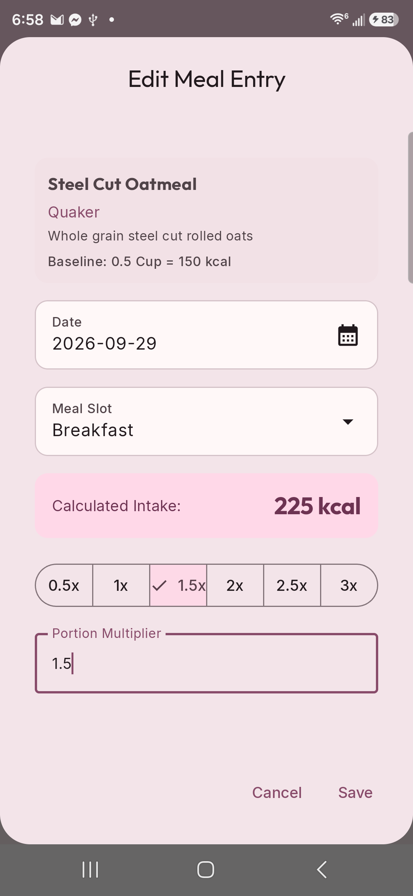](images/food-journal-2-mobile.png) | • Mobile-optimized search bar with category filters |
| **Portion Calculator** (Desktop) | [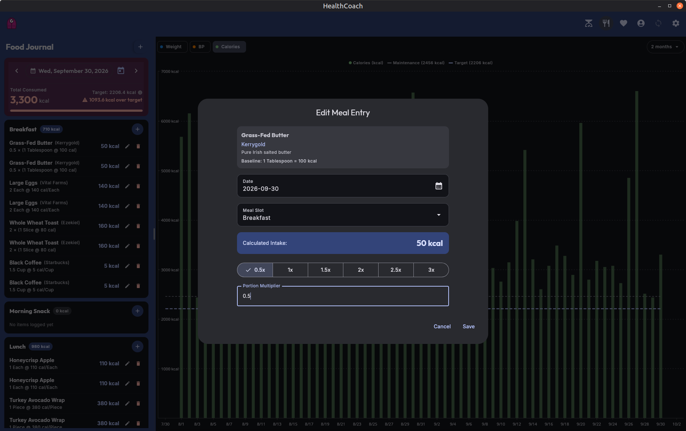](images/food-journal-3-desktop.png) | • Dynamic portion adjustments with live calorie calculation • Fractional serving and custom unit support |
| **Portion Calculator** (Mobile) | [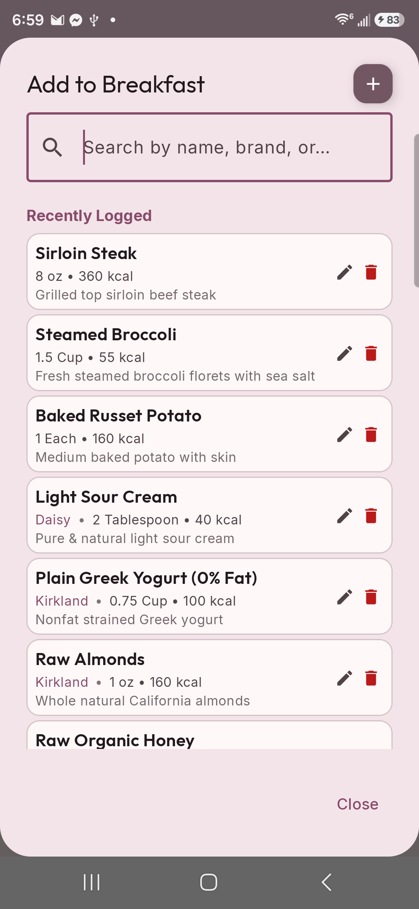](images/food-journal-3-mobile.png) | • Quick-adjust portion stepper and meal picker |

---

## 👤 User Profile, BMR/TDEE & Metabolic Goals

Validated Mifflin-St Jeor metabolic baseline calculation, personalized deficit/surplus goal planning, and projected timeline trajectories.

| View | Screenshot (Click to enlarge) | Highlights |
| :--- | :---: | :--- |
| **Personal Metrics** (Desktop) | [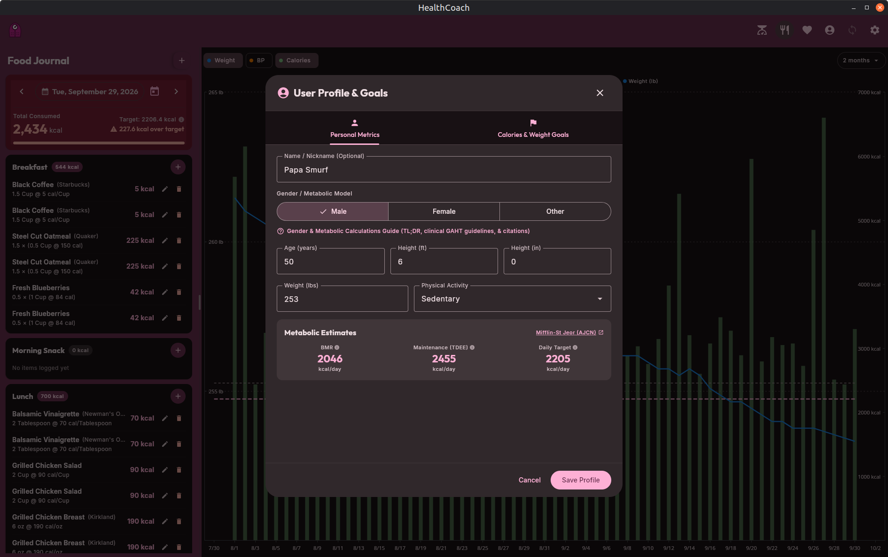](images/profile-1-desktop.png) | • Automated BMR and TDEE calculation • Activity level multipliers and physical metric inputs |
| **Personal Metrics** (Mobile) | [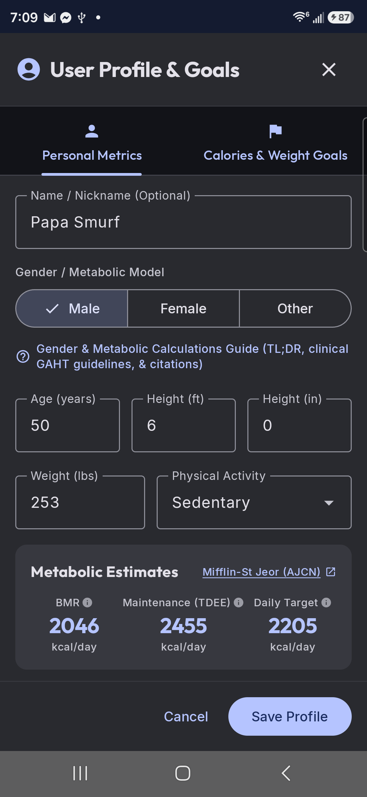](images/profile-1-mobile.png) | • Clean tabbed navigation for profile setup |
| **Goal Planning** (Desktop) | [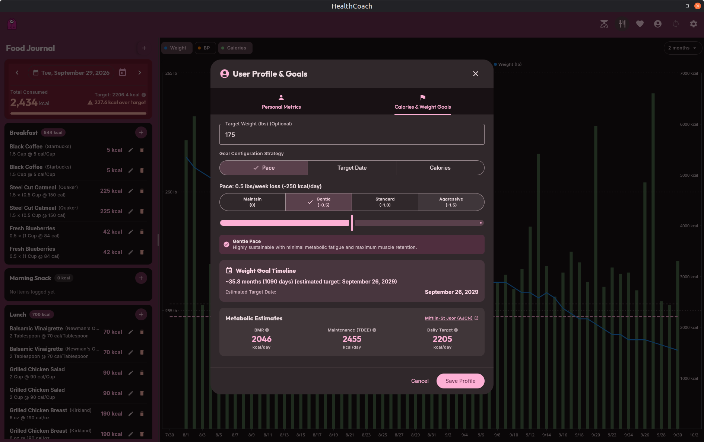](images/profile-2-desktop.png) | • Rate Goals, Timeline Goals, and Manual Calorie adjustments • Real-time projected target dates and required daily deficits |
| **Goal Planning** (Mobile) | [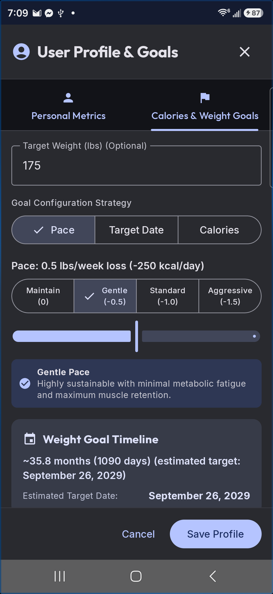](images/profile-2-mobile.png) | • Interactive goal mode selector and calorie recommendation |

---

## 📈 Compound Multi-Axis Graphs

Synchronized multi-series time visualization with decoupled Y-axes, adaptive graduation intervals in multiples of 5, and interactive data point markers.

| View | Screenshot (Click to enlarge) | Highlights |
| :--- | :---: | :--- |
| **Multi-Series View** (Desktop) | [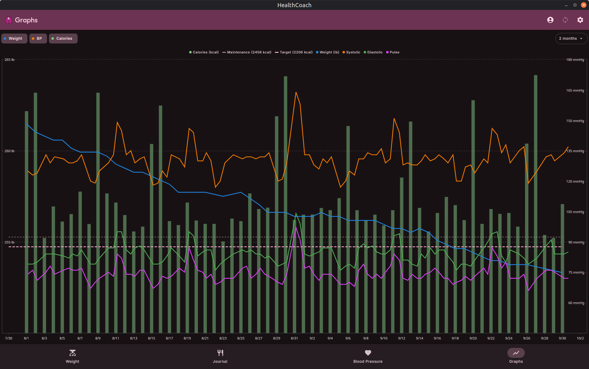](images/charts-1-desktop.png) | • Independent left axis (Weight) and right axis (BP/Pulse) • Background caloric intake layer with target line |
| **Multi-Series View** (Mobile) | [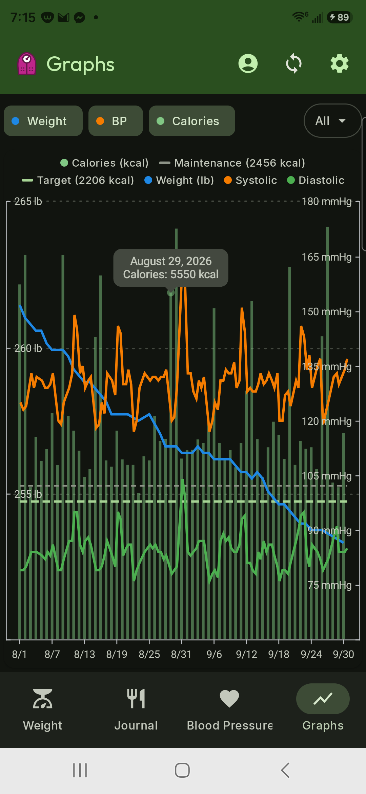](images/charts-1-mobile.png) | • Touch-and-drag marker tooltips for mobile data inspection |
| **Layer Toggles** (Desktop) | [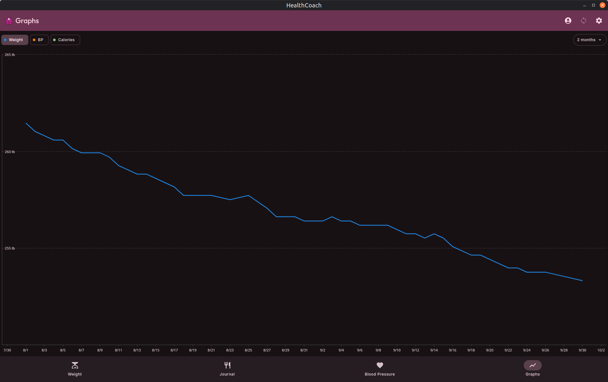](images/charts-2-desktop.png) | • Dynamic series visibility toggles (Weight, Systolic, Diastolic, Pulse, Calories, Targets) |
| **Layer Toggles** (Mobile) | [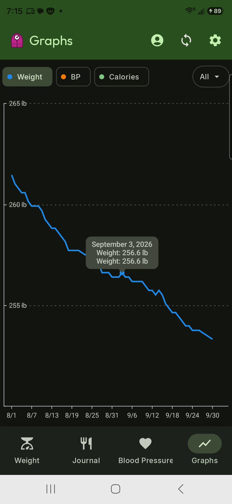](images/charts-2-mobile.png) | • Horizontal filter chips for quick layer customization |
| **Long-Term Timeframe** (Desktop) | [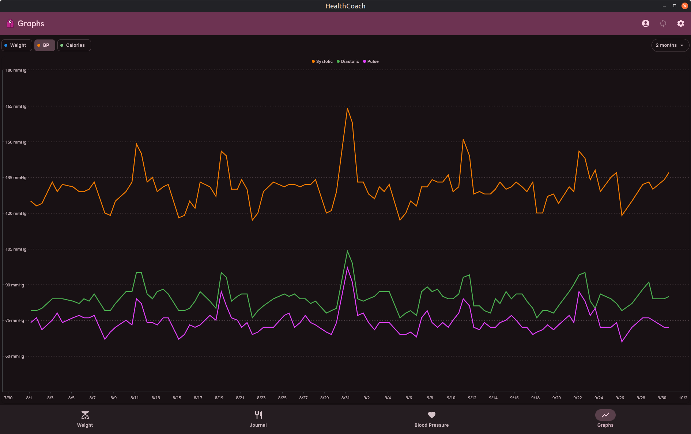](images/charts-3-desktop.png) | • Adaptive `YY/MM` date formatting across multi-year spans • Adaptive Y-axis stepping preventing visual crowding |
| **Long-Term Timeframe** (Mobile) | [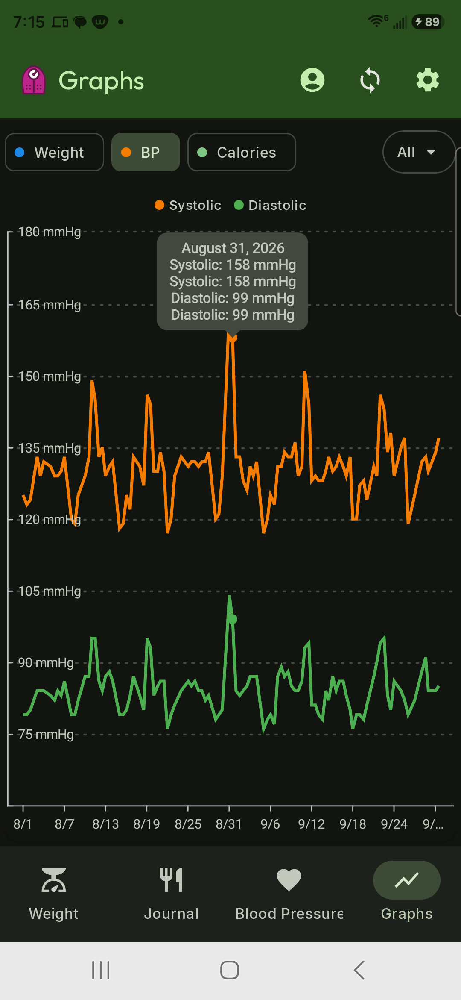](images/charts-3-mobile.png) | • Smooth pinch-to-zoom and pan across long health histories |

---

## 🔄 Multi-Device Synchronization & LAN Pairing

Local-first synchronization supporting directory mounts, Google Drive sandbox, and zero-configuration peer-to-peer Wi-Fi streaming.

| View | Screenshot (Click to enlarge) | Highlights |
| :--- | :---: | :--- |
| **Desktop** | [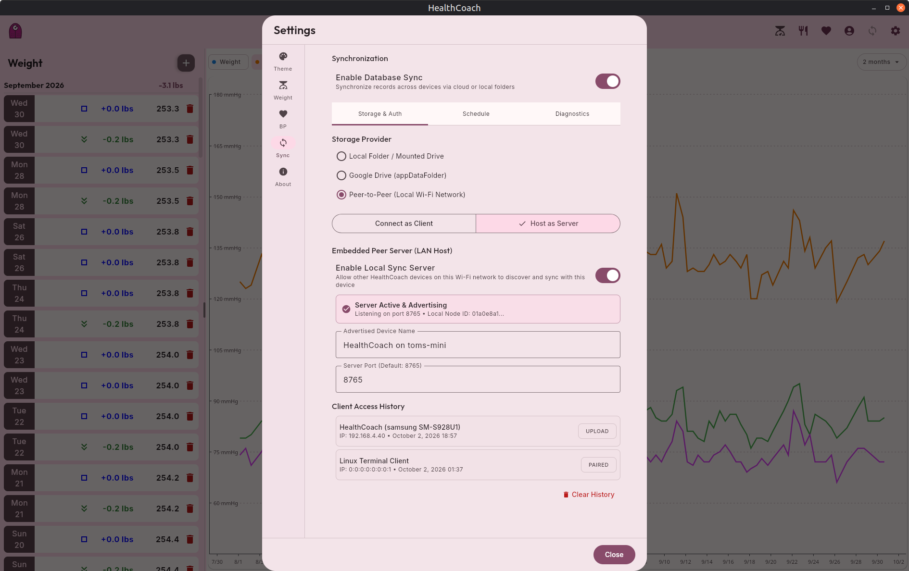](images/sync-desktop.png) | • Direct local directory / cloud-drive folder sync • Google Drive `appDataFolder` PKCE authorization • PIN-authenticated mDNS peer discovery and pairing |
| **Mobile** | [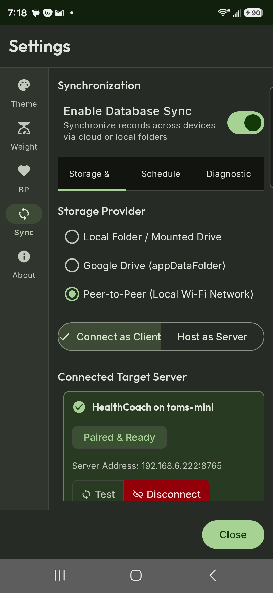](images/sync-mobile.png) | • 1-tap peer-to-peer Wi-Fi synchronization • 3-way differential merge status and sync history |

---

## 🎨 Adaptive Dual-Pane Split Layout & Curated Themes

Dynamic dual-pane layout for wide displays and single-pane navigation for mobile, paired with 4 Material 3 palettes and Light/Dark modes.

| View | Screenshot (Click to enlarge) | Highlights |
| :--- | :---: | :--- |
| **Desktop Split View** |  | • Side-by-side log table and live compound chart with draggable splitter • Material 3 color palettes (Burgundy, Indigo, Forest, Teal) • Light, Dark, and System theme switching |
| **Mobile Single Pane** |  | • Responsive bottom navigation bar • Seamless automatic theme transitions |

---

[← Back to Main README](../README.md)
