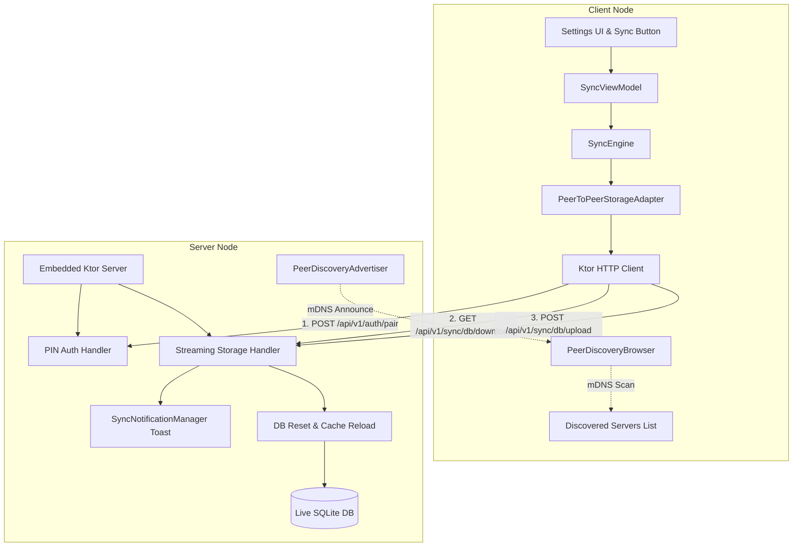

# Remote Database Synchronization

### Status: Active Implementation & Evolution

---

## 1. Overview & Objectives

HealthCoach is a local-first application where health metrics (body weights, blood pressure readings, pulse) are stored in an embedded SQLite database. The goal of this initiative is to enable private, cross-device synchronization between Desktop (JVM) and Android devices without requiring a centralized, proprietary backend server.

Users can synchronize their health records using their preferred storage targets:
* **Local Folders & Mounted Drives** (*Implemented*): Directories synchronized by Proton Drive Desktop, Microsoft OneDrive, Dropbox, or local network mounts.
* **Google Drive (`appDataFolder`)** (*Desktop Implemented, Android In Progress*): Scoped hidden sandbox partition in personal Google Drive via PKCE OAuth 2.0.
* **Peer-to-Peer (LAN Client-Server)** (*Active Plan / In Progress*): Direct Wi-Fi synchronization between running HealthCoach instances with zero-configuration mDNS discovery, binary database streaming, and PIN pairing.
* **Future Storage Adapters**: Microsoft OneDrive integration.

---

## 2. Core Architecture: 3-Way Snapshot Merge

Direct file copying over network shares risks corruption and completely overwrites concurrent modifications made on other devices. HealthCoach employs a cached 3-way snapshot merge reconciliation algorithm:

```
+---------------------------------------------------------+
|                    3-Way Merge Engine                   |
+-------------------+-------------------------------------+
| BASE              | Cached snapshot from last sync      |
| (synced_cache.db) | (reference point for diffs)         |
+-------------------+-------------------------------------+
| LOCAL             | Live active user database           |
| (live.db)         | (contains recent local edits)       |
+-------------------+-------------------------------------+
| REMOTE            | Snapshot downloaded from storage    |
| (remote.db)       | (contains remote device edits)      |
+-------------------+-------------------------------------+
```

### Reconciliation Workflow:
1. **Metadata Inspection & Concurrency Check**:
   * Inspect remote file metadata (SHA-256 hash, modified timestamp).
   * If remote file is missing (initial sync): Upload local database and initialize base cache.
   * If remote hash matches `last_synced_hash` and local database is unmodified: No-op.
2. **Pre-Sync Schema Compatibility Gates**:
   * SQLite `PRAGMA user_version` is checked on downloaded remote databases prior to merging.
   * If `local < remote`: Abort sync with alert prompting user to update the app.
   * If `local > remote`: Warn and confirm before migrating and upgrading remote schema.
3. **Differential Computation**:
   * Compute **Remote Differential** (`REMOTE` vs `BASE`): Detect remote inserts, updates (`updated_at > base.updated_at`), and deletions (present in `BASE` but absent in `REMOTE`).
   * Compute **Local Differential** (`LOCAL` vs `BASE`): Detect local inserts, updates, and deletions.
4. **Conflict Resolution (Last-Write-Wins)**:
   * Non-conflicting changes are applied bidirectionally to `LOCAL` and `REMOTE`.
   * For concurrent modifications on the same record, the row with the newer `updated_at` timestamp takes precedence.
   * Deletions vs modifications: Updates take precedence over deletions.
5. **Fresh Device Bootstrap & Initial Union Merge**:
   * If base cache is missing on an empty local install: All remote records are pulled down cleanly.
   * If base cache is missing on a populated local database: Perform a non-destructive union merge of all records.
6. **Optimistic Concurrency & Atomic Upload**:
   * Remote SHA-256 hash is validated before upload to ensure no concurrent modification occurred during merge computation; retries with fresh snapshot if conflicted.
   * Updated database is uploaded, `synced_cache.db` is updated, and sync metadata is recorded.

---

## 3. Implementation Status & Executed Components

### 3.1 Implemented Storage Adapters (`RemoteStorageAdapter`)
* **`LocalFolderAdapter` (Desktop & Android)**:
  * Operates on local filesystem paths, external USB drives, and desktop-synchronized cloud folders.
  * Ensures safe writes through atomic replacement via temporary files and SHA-256 integrity validation.
* **`GoogleDriveStorageAdapter` (Desktop)**:
  * Implements RFC 7636 PKCE (Proof Key for Code Exchange) OAuth 2.0 authorization flow using a local loopback server (`http://127.0.0.1:<port>/callback`).
  * Stores database snapshots in Google Drive's hidden `appDataFolder` (`https://www.googleapis.com/auth/drive.appdata`), isolated from regular user drive files.
  * Manages token lifecycle, automatic refresh, and streaming multipart uploads/downloads.

### 3.2 Core Sync Engine (`SyncEngine`)
* Executes 3-way differential merge across `WeightRecord` and `BloodPressureRecord` datasets.
* Enforces schema compatibility via SQLite `PRAGMA user_version`.
* Handles retry loops with exponential backoff on optimistic concurrency conflicts (`MAX_SYNC_RETRIES = 3`).

### 3.3 UI Diagnostics & Interaction
* **Top Bar Sync Action Button**:
  * Visible in `AppBar` whenever a sync provider is configured.
  * Infinite rotation animation during active synchronization.
  * Overlaid red exclamation badge if previous sync encountered errors.
  * Tap during sync triggers cancellation confirmation dialog.
* **Settings Dialog Sync Tab**:
  * Categorized settings navigation with mutually exclusive provider selection.
  * Real-time connection testing.
  * Detailed sync audit metadata: Last synced time, remote snapshot SHA-256 hash, and local/remote schema versions.
  * Global toast/snackbar notifications via `SyncNotificationManager`.

---

## 4. Peer-to-Peer (LAN) Synchronization Architecture

Peer-to-Peer synchronization allows HealthCoach instances to discover each other on a local Wi-Fi/LAN network and exchange database updates directly without third-party cloud infrastructure.



### 4.1 Key Architectural Decisions

1. **Platform Symmetry (Desktop & Android)**:
   * Any running instance—Desktop (JVM) or Android—can be configured as a **Server**, a **Client**, or both simultaneously.
2. **Embedded Ktor HTTP Server & Binary Streaming**:
   * Server runs an in-process Ktor HTTP Server with the `CIO` engine.
   * Uses dynamic port allocation (default preferred port `8765` with automated fallback).
   * Streams raw SQLite database files directly (`application/octet-stream`) via chunked transfer encoding (`ByteReadChannel`), preserving binary integrity and avoiding memory overhead.
   * Enforces optimistic concurrency via `expectedHash` headers on upload (returns `409 Conflict` if modified).
3. **Zero-Configuration Discovery (mDNS / DNS-SD)**:
   * Advertises and browses using service type `_healthcoach-sync._tcp.` with service name `HealthCoach synch`.
   * Advertises instance UUID (`instanceId`), device name (`deviceName`), interface version (`1.0`), and listening port.
   * Multiplatform discovery: `JmDNS` on Desktop (JVM) and native `NsdManager` on Android.
   * Maintains a dynamic list of discovered LAN servers, automatically filtering out the local node's own `instanceId`.
4. **Security & PIN Handshake**:
   * Server protects storage endpoints with a configurable or randomly generated 6-digit PIN.
   * Client performs a pairing handshake (`POST /api/v1/auth/pair`) to validate the PIN and obtain a session bearer token.
   * Token and server identity are saved in client settings for automatic subsequent syncs.
5. **Server Toast Notifications & Live DB Reload**:
   * Emits toast/snackbar notifications via `SyncNotificationManager` when clients connect, download, or upload records.
   * Upon receiving an uploaded database snapshot, atomically swaps the database file and executes a database reload hook to refresh active SQLDelight queries and UI state.
6. **RemoteStorageAdapter Integration**:
   * `PeerToPeerStorageAdapter` implements `RemoteStorageAdapter` using Ktor Client, allowing `SyncEngine`'s 3-way differential merge algorithm to run unchanged.

---

## 5. UI & User Experience

* **Provider Selection**:
  * Mutually exclusive selection across **Local Folder**, **Google Drive (`appDataFolder`)**, and **Peer-to-Peer (LAN)**.
* **Server Settings Section**:
  * Server enable/disable toggle.
  * Active listening status (bound IP address and port).
  * Server identity configuration and PIN code display / regeneration.
  * History log of recently serviced client devices.
* **Client Settings Section**:
  * Dynamic list of all discovered HealthCoach servers on the local network.
  * Manual host/port entry fallback for complex subnets.
  * PIN pairing modal dialog on initial connection.
  * Connection diagnostics and paired server status indicator.

---

## 6. Delivery Phases

| Phase | Description | Status |
| :--- | :--- | :--- |
| **Phase 1: Schema & Data Model Evolution** | UUID primary keys, `updated_at` timestamps, SQLite `PRAGMA user_version` migrations. | **Completed** |
| **Phase 2: Local & Desktop Cloud Storage** | `LocalFolderAdapter`, `GoogleDriveStorageAdapter` (Desktop PKCE flow), atomic writes. | **Completed** |
| **Phase 3: 3-Way Snapshot Merge Engine** | Differential delta extraction, `updated_at` LWW conflict resolution, schema gating, concurrency retries. | **Completed** |
| **Phase 4: Sync UI, Action Button & Feedback** | Modernized Settings Sync tab, animated `SyncActionButton`, failure overlays, cancel modals, toast dispatch. | **Completed** |
| **Phase 5: Peer-to-Peer LAN Synchronization** | Embedded Ktor server, binary DB streaming, mDNS discovery, PIN pairing, live DB reset, `PeerToPeerStorageAdapter`. | **Active / In Progress** |
| **Phase 6: Android Google Drive & Future Cloud** | Android native Google Play Services Drive integration, Microsoft OneDrive. | **Upcoming** |
